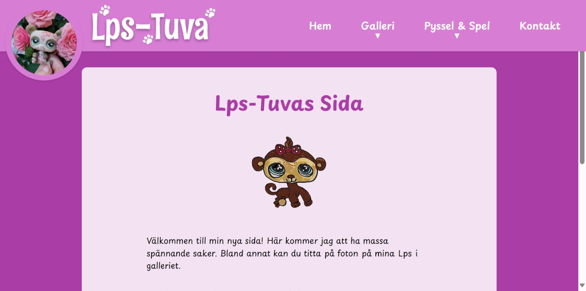

# Lps-Tuva 🐈 🦜🐟 🐢 🐶

This site is live at: https://lpstuva.onrender.com

This is the site of Lps-Tuva! 

## The design
This is the plan I did in Figma:
Mobileversion:
  

Tablet och Desktopversion:

## I used:
- React
- Vite
- Typescript
- Styled Components

## To run the project on your local machine:

- npm run dev

## To deploy the project to GitHubPages run this command every time you pushed and want to do a new build: 

- rm -rf dist
- npm run build
- npm run deploy

## The form uses React hook form and Reg Ex to validate:

- npm install react-hook-form @hookform/resolvers yup

## Font Awesome Social Icons:

- npm install --save @fortawesome/react-fontawesome @fortawesome/free-brands-svg-icons

- Har använt Spotify, Instagram och YouTube i Footern. 

## Install axios in front end for using fetch och post
npm install axios
npm install emailjs-com
npm install framer-motion till switchknappen

## Supabase till att Tuva själv kan uppdatera texten i sin sida, genom Admin-komponenten: 
- npm install @supabase/supabase-js

## Komprimera bilder innan de skickas till Supabase så att de inte överstiger en viss storlek:
- npm install browser-image-compression

## Ikon till password
- npm install lucide-react

## Memoryspelet

### Kortflippningsfakta:
För att vända korten i memoryspelet använder jag klassen "flipped" i kombinatione med CSS för att skapa en flip-animation. Klassen "flipped" sätts baserat på om kortet är valt eller ej. När ett kort väljs får den klassen "flipped". Jag använder className="flipped" för att styra flippningen, och själva animeringen hanteras i CSS med transform: rotateY(180deg).

### Ljud/Sounds: 🔊

Från Freesound.com:
- Flip.ogg by egomassive -- https://freesound.org/s/536782/ -- License: Attribution 3.0
- achievement-sparkle by pigeonfriend -- https://freesound.org/s/715067/ -- License: Creative Commons 0

### To the Puzzle
- npm install react-dnd react-dnd-html5-backend

### Cookies:
- npm install js-cookie

### Reload och Cache problem - lösning
Dessa filer används vid problem när uppdateringar inte laddas upp automatiskt i Browsern hos användaren:
1.Installera pluginet PWA - npm install vite-plugin-pwa
2. vite.config.ts
3. main.tsx
4. virtual.d.ts 
5. static.json
Version check (lite av den i nån av ovanstående filer också kanske)
6. index.html - lägg in <meta name="version" content="%VITE_APP_VERSION%">
7. versionCheck.js
8. swListener.js

# ----------------------- Backend -------------------------- not in use right now

## PostgreSQL:

- npm init -y
- npm install express pg dotenv
- npm install --save-dev typescript @types/node @types/express ts-node nodemon
- npm install --save-dev @types/pg

Generera en TypeScript-konfigurationsfil:
- npx tsc --init

