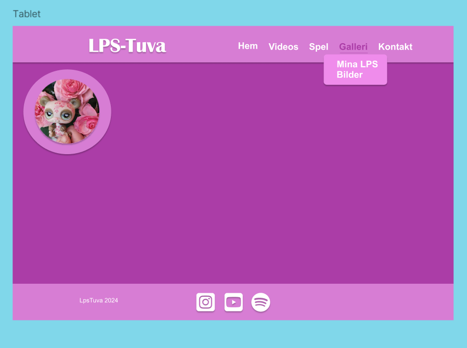

# LpsTuva 🐈 🦜🐟 🐢 🐶

- Det här är Tuvas Littlest Petshop sida! 

## Här är designen:
Mobilversion:
  

Tablet och Desktopversion:

### Gjort med:
- React
- Vite
- Typescript
- Styled Components

### För att köra projektet lokalt:

- npm run dev

### För att deploya projektet till GitHubPages kör detta kommando varje gång du pushat och vill göra build: 

- rm -rf dist
- npm run build
- npm run deploy

## The form uses React hook form and Reg Ex to validate:

- npm install react-hook-form @hookform/resolvers yup

## Font Awesome Social Icons:

- npm install --save @fortawesome/react-fontawesome @fortawesome/free-brands-svg-icons

- Har använt Spotify, Instagram och YouTube i Footern. 

## Installera axios i front end för att kunna använda fetch och post
npm install axios

# --------------------------------- Backend ----------------------------------------------------

## Mongo DB Atlas:

- npm install mongoose
## Gjorde en backend-mapp:

mkdir backend
cd backend
npm init -y
npm install express mongoose dotenv
npm istall
npm install cors  
npm install --save-dev @types/node    // Vid typescript. Kanske även när jag har js ibackend och ts i frontend.

## Starta Backend-servern:

- npm start

Jag använder Javascript i backenden
stäng av med ctrl c

